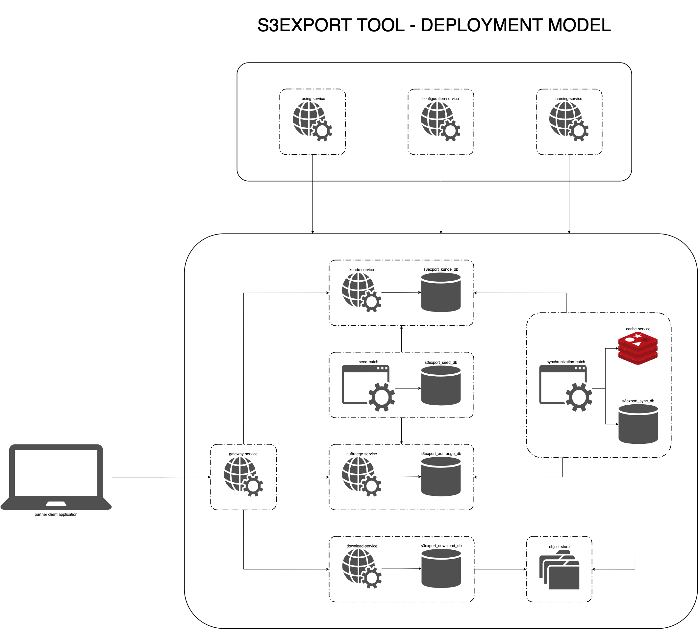

# JAVA EXERCISE

s3export.germany.2021-09-03

germany+2021-09-3_12-09-56.csv

---
### PREFACE
I had a lot of fun in completing this exercise because of the wide variety of topics that it covers ranging from architecture to system design to data analysis and modelling to considering performance and automating deployments. It was indeed a pleasure for me to have been offered this challenge as it tested my knowledge, and skills while giving me an idea on the kind of work that IONOS does.

---
### TECHNOLOGY STACK
| Technology | Implementations/Frameworks | Version | Purpose |
| ----------- | ----------- | ----------- | ----------- |
| Java | OpenJDK HotSpot VM | 11 | JVM |
| Java | Spring Boot | 2.3.9 | Web Services framework |
| Java | Spring Batch | 2.3.9 | Batch processing framework |
| Java | Spring Cloud | Hoxton | Microservice framework |
| Java | Javafaker | 1.0.2 | Seed data generator |
| Java | Apache Tika | 2.1.0 | File MIME type detection |
| Java | Jib | 3.1.4 | Mavenized docker image creation |
| Java | TOAB Chassis SDK | 1.1.0-SNAPSHOT | Personalized design patterns |
| Java | Open Zipkin |  2.23.2 | Distributed tracing |
| Java | JUnit | 5 | Unit testing |
| Java | Maven | 3.6.x | Build artifacts and execute tests |
| OpenAPI | Swagger | 3 | REST API Documentation |
| NoSQL | Redis | 3.0.5 | fast data sharing between batch job steps |
| RDBMS | MySQL | 8.0.2 | Persistent data storage with ACID gaurantee |
| Go | Minio | RELEASE.2021-08-31T05-46-54Z.fips | Object storage |
| ELK | Elasticsearch, Logstash, Kibana | 7.14.0 | Log processing, indexing, visualization |
| Virtualization | Docker | 20.10.5 | Platform agnostic containerization |

---
### MINIMUM SYSTEM REQUIREMENTS
1. Unix based Operating System - Linux or MacOS
2. Disk - 6 GB
3. Memory - 8 GB
4. Processor - 2 CPU
5. Network - 100 MBps
6. Operating System - Ubuntu 20.4/Windows 10/MacOS 10.5

---
### ENSURE THE FOLLOWING ARE AVAILABLE
1. JDK - 11
2. Python - 3.9
3. Maven - 3.6.x
4. Docker - 20.10.x
5. Docker Compose - 1.28.x
6. MySQL - 8.0.x
7. Redis - 3.0.x
8. MiniO - RELEASE.2021-06-17T00-10-46Z
9. Zipkin - 2.23.2
10. JAVA_HOME and MAVEN_HOME is set on the host system

---
### THE FOLLOWING ARE REQUIRED IF NOT CHOOSING THE DOCKER APPROACH
1. MySQL is running on port 3306
2. Redis Server is running on port 6379
3. MiniO object storage is running on port 9000
4. Logstash is running on port 4560
5. Elasticsearch is running on port 9200
6. Kibana is running on port 5601
7. Zipkin is running on port 9411
8. Ports 8081, 8761, 8888 are free
9. Ports 7001, 8001, 9001, 10001, 11001 are free

---
### STEPS TO INSTALL AND RUN - DOCKER APPROACH
1. After you have checked out the project from github, open terminal or command prompt on your host system
2. Go to the root folder of the project `coding-challenge-ionos-javatestaufgabe` under the location where you have checked out the source code
3. Execute `mvn clean package -e` at the root folder of the project containing all the projects to download dependencies and build the artifacts
4. Execute `mvn clean install -DskipTests -e` at the root folder of the project to install the artifacts locally
5. Execute the script `setup.sh` if on a nix system or `setup.bat` if on a win32 system
6. Go to the location `scripts/docker/compose/nix` under the root folder of the project through terminal
7. Execute `docker-compose -f stack-1.infrastructure-storage.yml up` at the location to start all the storage service containers for the microservice ecosystem
8. Execute `docker-compose -f stack-2.infrastructure-logging.yml up` at the location to start all the logging service containers for the microservice ecosystem
9. Execute `docker-compose -f stack-3.application-operations.yml up` at the location to start all the operation service containers for the microservice ecosystem
10. Wait for all the docker containers under `stack-3.application-operations.yml` to start 
11. Open you browser and navigate to `localhost:8761` to verify if the naming-service is up or not. The naming-service is called Eureka Server
12. Wait until you see Eureka server's home page. Once the naming-service is available and you can view Eureka Server's home page, continue further
13. Execute `docker-compose -f stack-4.application-web-services.yml up` at the location to start all the web service containers for the microservice ecosystem
14. Wait for all the web service containers to become available . Verify in Eureka server's dashboard if the following services are listed as UP: `AUFTRAEGE-SERVICE, DOWNLOAD-SERVICE, GATEWAY-SERVICE, KUNDE-SERVICE`
15. Execute `docker-compose -f stack-5.application-batch-jobs.yml up` at the location to start all the batch job containers for the microservice ecosystem
16. Wait for all the batch job containers to become available . Verify in Eureka server's dashboard if the following services are listed as UP: `SEED-BATCH, SYNCHRONIZATION-BATCH`
17. Open your browser and browse to `http://localhost:9001/swagger-ui.html` to access the Swagger documentation console for the download-service
18. Execute the REST APIs as per the functionality of the system. Refer to the `FEATURES` section to get an idea of the functionality of the system. 

---
### STEPS TO STOP - DOCKER APPROACH
1. Open terminal or command prompt
2. Go to the root folder of the project `coding-challenge-ionos-javatestaufgabe` under the location where you have checked out the source code
3. Go to the location `scripts/docker/compose/nix` under the root folder of the project
4. Execute `docker-compose -f stack-5.application-batch-jobs.yml down` at the location to stop all the batch job containers for the microservice ecosystem
5. Execute `docker-compose -f stack-4.application-web-services.yml down` at the location to stop all the web service containers for the microservice ecosystem
6. Execute `docker-compose -f stack-3.application-operations.yml down` at the location to stop all the operation service containers for the microservice ecosystem
7. Execute `docker-compose -f stack-2.infrastructure-logging.yml down` at the location to stop all the logging service containers for the microservice ecosystem
8. Execute `docker-compose -f stack-1.infrastructure-storage.yml down` at the location to stop all the storage service containers for the microservice ecosystem

---
### FEATURES
1. Get the list of available countries
2. Download the latest customer data for a country
2. Download the customer data of a country in CSV format
3. Error reporting with codes and descriptive messages 

---
### ARCHITECTURE
[//]: # [Click here to see](https://i.ibb.co/6RW1HRQ/s3export-tool-architecture.png)

---
### COMPONENTS
[//]: # [synchronization-batch](https://i.ibb.co/HrfM69k/component-synchronization-batch-Component-S3-EXPORT-Synchronization-Batch.png)

[//]: # [download-service](https://i.ibb.co/x3wrwLs/component-download-service-Component-S3-EXPORT-Download-Service.png)

---
### BUSINESS FLOWS SEQUENCES
[//]: # [Synchronize and export kunde and auftraege data every N time](https://i.ibb.co/5YvhCwZ/sequence-synchronize-auftraege-and-kunde-data-every-N-time-and-export-Synchronize-Auftraege-and-Kund.png)

[//]: # [Get list of all countries](https://i.ibb.co/L1RW4QY/sequence-get-list-of-all-available-countires-Get-list-of-all-available-countries.png)

[//]: # [Download latest kunde and auftraege data by country](https://i.ibb.co/FY5KdG8/sequence-download-latest-kunde-auftraege-data-by-country-as-csv-Download-latest-Kunde-Auftraege-data.png)

---
### PROJECT DESCRIPTION
| SERVICE NAME | FUNCTIONALITY | TYPE |
| ----------- | ----------- | ----------- |
| configuration-service | Centralized configuration store for all microservices | Maven Project |
| naming-service | Service registration and discovery for all microservices by their name| Maven Project |
| gateway-service | Single entry point to provided accessibility for all microservices by their API, routes request to appropriate microservices | Maven Project |
| auftraege-service | Web service endpoints to create and retrieve Auftraege details | Maven Project |
| kunde-service | Web service endpoints to create and retrieve Kunde details | Maven Project |
| download-service | Web service endpoints to download |country specific customer data  Maven Project |
| seed-batch | Simulate creation of auftraege and kunde data to be used by tool for DEMO purpose | Maven Project |
| synchronization-batch | Export customer data as CSV | Maven Project |
| cache-service | Passes large volumes of data between steps of batch job, having a TTL set against its key | Binary 
| rdbms-service | Stores kunde and auftraege details, along with batch execution details and download audit logs | Binary 
| object-storage-service | Stores kunde data in CSV format with associated date for each file by country | Binary 
| tracing-service | Trace requests across microservices for debugging | Binary
| ELK | Distributed logging across microservices | Binary

---
### ASSUMPTIONS
1. All timestamps are managed with respect to UTC
2. `auftragid` and `artikelnummer` are stored as strings because each `auftraege` record may come from 3rd party systems as well
3. Auftrage data search and creation APIs have been implemented for brevity
4. Auftraege provides the last N time data it contains by checking against the `lastchange` property of each `auftrage` data entry
5. Last N time can be one of: `Last N hours, Last N minutes, Last N seconds` 
6. `kundenid` is stored as an unsigned whole number starting from 1 onwards as it is mostly system generated
8. Kunde data search and create APIs have been implemented for brevity
9. REST API documentation has been disabled for Auftraege and Kunde Services and Seed and Synchronization batches because they will not be user facing
10. All internal service calls via HTTP take place through the system Gateway Service
11. Seed Batch updates new Auftraege and Kunden data within short periods of time to make fresh data available for the core features 
12. Seed batch skips writing a generated `auftraege` or '`kunde` record that it created during its job run if the downstream service for the respective domain is down
13. Synchronization Batch combines Kunde data with its associated Auftraege data, grouped by country for each Kunde and exports them into an object store for download

---
### FUNCTIONAL DECISIONS
1. Kunde spans across 8 countries only: `Germany, Spain, Italy, France, USA, Mexico, Canada, Romania`
2. Download Service allows to retrieve the list of currently available countries only, based on the buckets available in the object store 
3. Download Service allows to download the combined Kunde and Auftrage data for a country in CSV format, either the latest one available by date or on a specific date-time
4. Download Service requires a mandatory user sequence number as a header value during downloads, which should be a positive whole number for audit purpose
5. No file will be available for download if no eligible data is found for export activity during the last N time by Synchronization Batch
6. Error message will be returned if there is request to download using an unavailable country, wrong dat-time format or without a user sequence value
7. Downloaded CSV file name has the format: `'country'+'yyyy-MM-dd_HH-mm-ss'+'.csv'`
8. A positive whole number should be provided as a user sequence value for downloading customer data as CSV files in order to ascertain a minimum level of integrity of the calling client 

---
### TECHNICAL DECISIONS
1. All web services should scale horizontally to keep up with dynamic load in favour of being high performance
2. All batch jobs should scale vertically to in case of high load for favouring high performance since it runs periodically and is designed for handling large volumes of data
3. OpenAPI has only been enabled for customer facing services viz., download
4. Integration tests have been written to assert the business logic of core web services viz., auftraege, kunde, download 
5. Seed Batch is intended to be write intrinsic while Synchronization Batch is intended to be read intrinsic through a distributed workflow spanning across multiple microservices to establish the business logic. This has been done to avoid bottle-neck and any single point of failure.
6. Each web service is a spring boot application following the pattern of controller, service and repository, where repository can adapt to a database or an external service as per the respective microservice's use case
7. All web services have their individual exception handler to translate exceptions to HTTP error responses with appropriate HTTP status codes
8. Each batch job is a spring batch application following the pattern of reader, processor, writer combined in a single step job
9. Each infrastructure service is a spring cloud application acting as an independent standalone server
10. All batch jobs run within a web container and are triggered periodically by a scheduled business service
11. All scheduling are configured using cron expressions
12. Functional interfaces have been defined in each microservice to perform one off business logic
13. All business specific exceptions are checked exceptions having a custom message and an enum based error code which in turn contains a predefined application specific error code in the format `S3E-<INITIALS-OF-SERVICE-NAME>-<INCREMENTING-NUMBER>` and its corresponding HTTP Status code
14. Each microservice has a REST webservice error handler that catches any business specific exception to translate them into appropriate error messages and HTTP status codes
15. Sleuth and Zipkin has been added to each of the core microservices for the purpose of tracing distributed requests across multiple microservices
16. Application specific configuration changes are loaded and propagated downstream in the order as follows: java system variables, bootstrap.properties, <APPLICATION_NAME>-<PROFILE>.properties in configuration server
[//]: # 17. All services have been assigned static IPs when running as docker containers where the subnet has a capacity of accommodating 2^25 -1 machines for scalability
17. Configuration store for all services and batches is chosen as a remote git repository for distributed management
18. The algorithm to seed `auftrag` and `kunde` schema uses a library called `javafaker` to  generate the attributes of each schema in their respective job flows and has a time complexity of `O(n)` where n is the batch size
19. The algorithm to combine and export `kunde` and `auftrag` as CSV files  has a time complexity of `O(x)` where x is the number of auftraege items in the last N time

---
### BACKLOG
1. Optimize synchronization-batch by skipping writing to file system first and directly upload to the object storage
2. download-service to track details of available countries and uploaded files for a date in a database rather than directly querying the object storage
3. Event based communication between synchronization-batch and download-service to exchange uploaded file details via publish-subscribe model
4. Implement retry logic in synchronization-batch through spring AOP
5. Better bucket and object management logic within object storage 
6. Implement circuit breaker in gateway-service for all exposed services along with their dedicated fallbacks
7. Implement error handling in synchronization batch when kunde-service request trips circuit breaker
8. Implement proper audit service for all success and failure actions n download service
9. Health monitoring dashboard for all web services and batch jobs 
10. Block direct access to all web services and batch jobs, except through gateway
11. Enable security on all infrastructure services and core microservices
12. Enable authentication of redis cache server 
13. Encrypt security credentials in configuration store
14. Synchronize sequential bootstrap for each service and batch as per service dependency order across all microservices of this project within docker-compose
15. Fix internal IP based redirect by eureka server of registered service to use host system's hostname
16. Implement error handling in synchronization-batch to support job failure
17. Develop country microservice
18. Synchronization job to use country microservice for creating buckets    
19. Change bucket nomenclature ot include only found country names
18. Create logical paths inside each country bucket based on the date for the current day in `yyy-MM-dd` format
19. All CSV files for a country would be stored under the following path: `<COUNTRY_NAME>/<yyyy-MM-dd>/<COUNTRY_NAME>+<yyyy-MM-dd_HH-mm-ss>.csv` in their respective bucket
20. Dynamic ELK index per service/batch
21. Monitoring using Grafana and Prometheus
22. Metrics using micrometer

---
### ADDITIONAL RESOURCES
1. In the `scripts` folder under the root folder `s3export-tool` you will find the database scripts, docker compose files and logstash configuration corresponding to this microservice setup

---
### TROUBLESHOOTING
1. If your build is failing because the artifact `com.teenthofabud.core.common:toab-chassis-sdk:1.1.0-SNAPSHOT` is missing then follow the below steps to fix it
2. Clone this project from Github: `https://github.com/anirbandas18/toab-chassis-sdk.git`
3. Open your terminal or command prompt according to your system
4. Browse to the location where you cloned out the project `toab-chassis-sdk` via terminal or command prompt
5. Execute the command `mvn clean package -e`
6. Execute the command `mvn clean install -e`
7. You should see output on your terminal or command prompt indicating that maven successfully installed the artifact `com.teenthofabud.core.common:toab-chassis-sdk:1.1.0-SNAPSHOT`. 
8. This should resolve the issue of the missing artifact. Continue with the normal steps to install and run